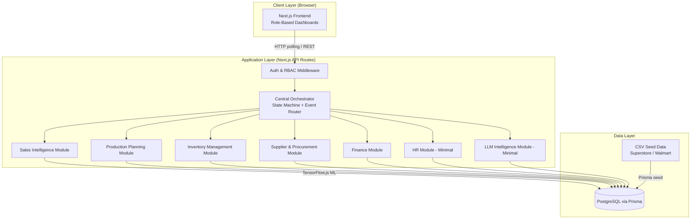
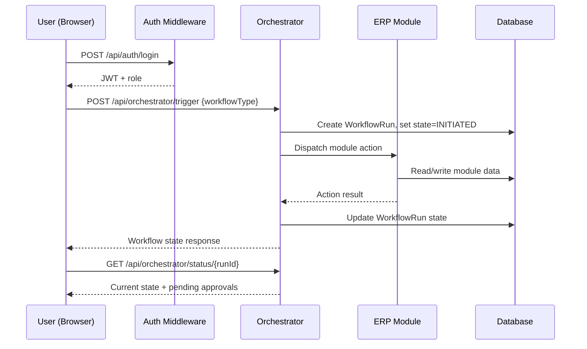
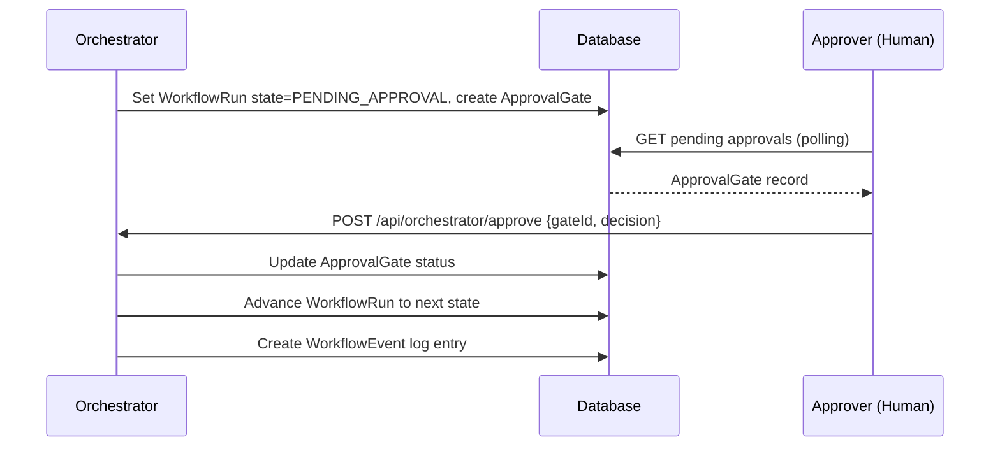
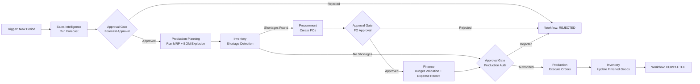
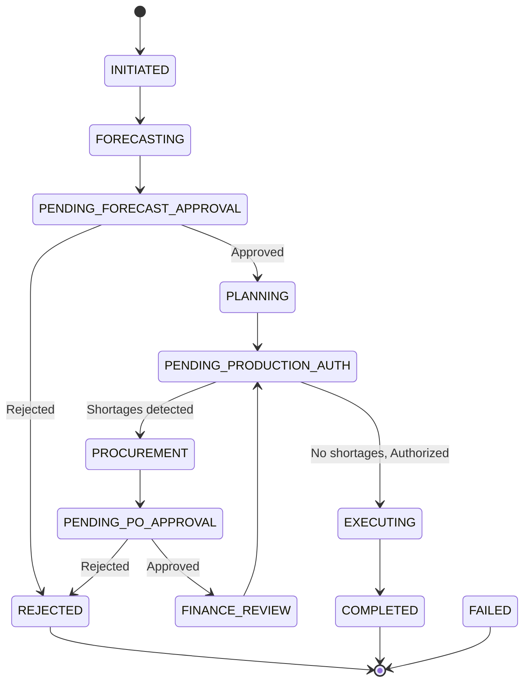

# Design Document: NexisERP — AI-Driven Cloud ERP System

## Overview

NexisERP is a cloud-based, AI-assisted ERP prototype built on a predictive-first architecture. A Central Orchestrator coordinates all enterprise workflows through a state machine, while an ML-powered Sales Intelligence module drives demand forecasting that cascades into production planning, inventory management, procurement, and finance. The system is designed for human-in-the-loop approval gates, role-based access, and real-time dashboard visibility across all modules.

The stack is Next.js (full-stack), Prisma ORM, TensorFlow.js for ML, and Docker for deployment. Data is seeded from Superstore/Walmart sales CSV datasets alongside synthetic supplier, BOM, and finance baseline records.

## Architecture

### System Layers



### Request Flow



### Approval Gate Flow



---

## Components and Interfaces

### Central Orchestrator

**Purpose**: Workflow coordination backbone. Owns the state machine, routes events between modules, manages approval gates, and maintains an immutable event log.

**Interface**:
```typescript
interface OrchestratorService {
  triggerWorkflow(type: WorkflowType, payload: Record<string, unknown>, triggeredBy: string): Promise<WorkflowRun>
  advanceState(runId: string, event: WorkflowEvent): Promise<WorkflowRun>
  requestApproval(runId: string, gate: ApprovalGateType, requiredRole: Role): Promise<ApprovalGate>
  resolveApproval(gateId: string, decision: 'APPROVED' | 'REJECTED', resolvedBy: string): Promise<WorkflowRun>
  getWorkflowStatus(runId: string): Promise<WorkflowRun>
  getEventLog(runId: string): Promise<WorkflowEvent[]>
}
```

**Responsibilities**:
- Maintain workflow state machine transitions
- Route module actions in correct sequence
- Block progression at approval gates until resolved
- Emit and persist all state change events

---

### Sales Intelligence Module

**Purpose**: ML-based demand forecasting using TensorFlow.js. Supports multiple model types, an AutoML leaderboard, and a feedback loop for model improvement.

**Interface**:
```typescript
interface SalesIntelligenceService {
  trainModel(config: ModelConfig): Promise<TrainedModel>
  runForecast(modelId: string, horizon: number): Promise<ForecastResult>
  getLeaderboard(): Promise<ModelLeaderboardEntry[]>
  submitForecastForApproval(forecastId: string): Promise<ApprovalGate>
  recordActuals(period: string, actuals: SalesActual[]): Promise<void>
  getMLOpsMetrics(modelId: string): Promise<MLOpsMetrics>
}
```

**Responsibilities**:
- Train Linear Regression, Random Forest, XGBoost models via TensorFlow.js
- Score models by MAE, RMSE, R² and rank in leaderboard
- Trigger orchestrator approval gate before forecast is consumed downstream
- Feed actuals back into training pipeline (MLOps loop)

---

### Production Planning Module

**Purpose**: MRP and BOM-based production calculation. Determines what to produce, how much, and whether resources are available.

**Interface**:
```typescript
interface ProductionPlanningService {
  runMRP(forecastId: string): Promise<ProductionPlan>
  getBOM(productId: string): Promise<BOMItem[]>
  checkProductionReadiness(planId: string): Promise<ReadinessReport>
  authorizePlan(planId: string, authorizedBy: string): Promise<ProductionPlan>
}
```

**Responsibilities**:
- Explode BOM to derive raw material requirements from forecast demand
- Cross-reference inventory levels to identify shortfalls
- Generate production orders pending authorization

---

### Inventory Management Module

**Purpose**: Real-time stock tracking, shortage detection, safety stock alerting, and finished goods tracking.

**Interface**:
```typescript
interface InventoryService {
  getStockLevel(itemId: string): Promise<StockLevel>
  detectShortages(planId: string): Promise<ShortageReport>
  updateStock(itemId: string, delta: number, reason: string): Promise<StockLevel>
  getSafetyStockAlerts(): Promise<SafetyStockAlert[]>
  recordFinishedGoods(productId: string, quantity: number): Promise<void>
}
```

**Responsibilities**:
- Maintain current on-hand quantities per SKU/material
- Compare MRP requirements against on-hand to surface shortages
- Alert when stock falls below safety stock threshold
- Update finished goods inventory after production completion

---

### Supplier & Procurement Module

**Purpose**: Supplier lookup, purchase order creation, procurement status tracking, and delivery confirmation.

**Interface**:
```typescript
interface ProcurementService {
  findSuppliers(materialId: string): Promise<Supplier[]>
  createPurchaseOrder(po: CreatePOInput): Promise<PurchaseOrder>
  getPOStatus(poId: string): Promise<PurchaseOrder>
  confirmDelivery(poId: string, receivedQty: number): Promise<PurchaseOrder>
  getPendingPOs(): Promise<PurchaseOrder[]>
}
```

**Responsibilities**:
- Match shortage materials to qualified suppliers
- Draft POs and route through finance approval gate
- Track PO lifecycle: DRAFT → APPROVED → ORDERED → DELIVERED
- Trigger inventory update on delivery confirmation

---

### Finance Module

**Purpose**: Budget validation, PO approval, and expense tracking.

**Interface**:
```typescript
interface FinanceService {
  validateBudget(amount: number, costCenter: string): Promise<BudgetValidation>
  approvePO(poId: string, approvedBy: string): Promise<PurchaseOrder>
  rejectPO(poId: string, rejectedBy: string, reason: string): Promise<PurchaseOrder>
  recordExpense(expense: ExpenseInput): Promise<Expense>
  getBudgetSummary(costCenter: string): Promise<BudgetSummary>
}
```

**Responsibilities**:
- Check available budget before PO approval
- Approve or reject POs with audit trail
- Track committed vs. actual spend per cost center

---

### HR Module (Minimal)

**Purpose**: Basic employee records and workforce allocation markers.

**Interface**:
```typescript
interface HRService {
  getEmployee(employeeId: string): Promise<Employee>
  listEmployeesByDepartment(dept: string): Promise<Employee[]>
  allocateToWorkflow(employeeId: string, workflowRunId: string): Promise<void>
}
```

---

### LLM Intelligence Module (Minimal)

**Purpose**: Natural language summaries of workflow state for executive and analyst consumption.

**Interface**:
```typescript
interface LLMService {
  summarizeWorkflow(runId: string): Promise<string>
  explainForecast(forecastId: string): Promise<string>
}
```

---

## Data Models

### User & RBAC

```typescript
model User {
  id         String   @id @default(cuid())
  email      String   @unique
  name       String
  role       Role
  department String?
  createdAt  DateTime @default(now())
  sessions   Session[]
}

enum Role {
  ADMIN
  SALES_ANALYST
  PRODUCTION_PLANNER
  INVENTORY_MANAGER
  PROCUREMENT_OFFICER
  FINANCE_MANAGER
  EXECUTIVE
}
```

---

### Orchestrator

```typescript
model WorkflowRun {
  id           String          @id @default(cuid())
  type         WorkflowType
  state        WorkflowState
  payload      Json
  triggeredBy  String
  createdAt    DateTime        @default(now())
  updatedAt    DateTime        @updatedAt
  events       WorkflowEvent[]
  approvals    ApprovalGate[]
}

model WorkflowEvent {
  id            String      @id @default(cuid())
  workflowRunId String
  eventType     String
  fromState     String
  toState       String
  metadata      Json?
  occurredAt    DateTime    @default(now())
  workflowRun   WorkflowRun @relation(fields: [workflowRunId], references: [id])
}

model ApprovalGate {
  id            String           @id @default(cuid())
  workflowRunId String
  gateType      ApprovalGateType
  requiredRole  Role
  status        ApprovalStatus   @default(PENDING)
  resolvedBy    String?
  resolvedAt    DateTime?
  workflowRun   WorkflowRun      @relation(fields: [workflowRunId], references: [id])
}

enum WorkflowType {
  DEMAND_TO_PLAN
  PLAN_TO_PRODUCE
  PROCURE_TO_PAY
}

enum WorkflowState {
  INITIATED
  FORECASTING
  PENDING_FORECAST_APPROVAL
  PLANNING
  PENDING_PRODUCTION_AUTH
  PROCUREMENT
  PENDING_PO_APPROVAL
  FINANCE_REVIEW
  EXECUTING
  COMPLETED
  REJECTED
  FAILED
}

enum ApprovalGateType {
  FORECAST_APPROVAL
  PRODUCTION_AUTHORIZATION
  PO_APPROVAL
}

enum ApprovalStatus {
  PENDING
  APPROVED
  REJECTED
}
```

---

### Sales Intelligence

```typescript
model SalesRecord {
  id         String   @id @default(cuid())
  date       DateTime
  productId  String
  region     String
  quantity   Float
  revenue    Float
  source     String   // "superstore" | "walmart"
}

model TrainedModel {
  id          String   @id @default(cuid())
  modelType   ModelType
  trainedAt   DateTime @default(now())
  mae         Float
  rmse        Float
  r2Score     Float
  artifactPath String
  isActive    Boolean  @default(false)
}

model ForecastResult {
  id          String   @id @default(cuid())
  modelId     String
  generatedAt DateTime @default(now())
  horizon     Int      // days ahead
  predictions Json     // [{date, productId, predictedQty}]
  status      ForecastStatus @default(DRAFT)
  approvedBy  String?
  approvedAt  DateTime?
}

enum ModelType {
  LINEAR_REGRESSION
  RANDOM_FOREST
  XGBOOST
  ARIMA
}

enum ForecastStatus {
  DRAFT
  PENDING_APPROVAL
  APPROVED
  REJECTED
}
```

---

### Production Planning

```typescript
model Product {
  id       String    @id @default(cuid())
  sku      String    @unique
  name     String
  bomItems BOMItem[]
}

model BOMItem {
  id         String   @id @default(cuid())
  productId  String
  materialId String
  quantity   Float
  unit       String
  product    Product  @relation(fields: [productId], references: [id])
  material   Material @relation(fields: [materialId], references: [id])
}

model ProductionPlan {
  id           String              @id @default(cuid())
  forecastId   String
  createdAt    DateTime            @default(now())
  status       ProductionPlanStatus
  authorizedBy String?
  orders       ProductionOrder[]
}

model ProductionOrder {
  id             String         @id @default(cuid())
  planId         String
  productId      String
  requiredQty    Float
  scheduledStart DateTime?
  scheduledEnd   DateTime?
  status         OrderStatus
  plan           ProductionPlan @relation(fields: [planId], references: [id])
}

enum ProductionPlanStatus {
  DRAFT
  PENDING_AUTHORIZATION
  AUTHORIZED
  IN_PROGRESS
  COMPLETED
}

enum OrderStatus {
  PENDING
  IN_PROGRESS
  COMPLETED
  CANCELLED
}
```

---

### Inventory

```typescript
model Material {
  id           String      @id @default(cuid())
  sku          String      @unique
  name         String
  unit         String
  onHand       Float       @default(0)
  safetyStock  Float       @default(0)
  reorderPoint Float       @default(0)
  bomItems     BOMItem[]
  stockLedger  StockLedger[]
}

model StockLedger {
  id         String   @id @default(cuid())
  materialId String
  delta      Float
  reason     String
  reference  String?
  occurredAt DateTime @default(now())
  material   Material @relation(fields: [materialId], references: [id])
}

model FinishedGood {
  id        String   @id @default(cuid())
  productId String
  quantity  Float
  updatedAt DateTime @updatedAt
}
```

---

### Procurement & Finance

```typescript
model Supplier {
  id           String          @id @default(cuid())
  name         String
  leadTimeDays Int
  materials    SupplierMaterial[]
  purchaseOrders PurchaseOrder[]
}

model SupplierMaterial {
  supplierId String
  materialId String
  unitCost   Float
  supplier   Supplier @relation(fields: [supplierId], references: [id])
  @@id([supplierId, materialId])
}

model PurchaseOrder {
  id           String    @id @default(cuid())
  supplierId   String
  materialId   String
  quantity     Float
  unitCost     Float
  totalCost    Float
  status       POStatus  @default(DRAFT)
  createdAt    DateTime  @default(now())
  approvedBy   String?
  approvedAt   DateTime?
  deliveredAt  DateTime?
  supplier     Supplier  @relation(fields: [supplierId], references: [id])
}

model Budget {
  id          String   @id @default(cuid())
  costCenter  String   @unique
  totalBudget Float
  committed   Float    @default(0)
  spent       Float    @default(0)
}

model Expense {
  id          String   @id @default(cuid())
  costCenter  String
  amount      Float
  description String
  reference   String?
  recordedAt  DateTime @default(now())
}

enum POStatus {
  DRAFT
  PENDING_APPROVAL
  APPROVED
  ORDERED
  DELIVERED
  REJECTED
}
```

---

### HR (Minimal)

```typescript
model Employee {
  id         String  @id @default(cuid())
  name       String
  email      String  @unique
  department String
  role       String
  userId     String? @unique
}
```

---

## Module Interaction Through the Orchestrator

The Orchestrator is the single coordination point. Modules never call each other directly — all cross-module communication flows through orchestrator-dispatched actions.

### Primary Workflow: Demand-to-Plan



### State Machine Transitions



---

## Error Handling

### Error Scenario 1: Forecast Training Failure

**Condition**: TensorFlow.js model training throws an error (insufficient data, NaN loss)
**Response**: Orchestrator sets WorkflowRun state to FAILED, logs WorkflowEvent with error metadata
**Recovery**: User can re-trigger workflow with adjusted model config or date range

### Error Scenario 2: Budget Exceeded on PO

**Condition**: Finance module detects PO total cost exceeds available budget
**Response**: PO remains in DRAFT, Finance module returns validation failure, Orchestrator blocks PO approval gate
**Recovery**: Finance Manager adjusts budget or Procurement Officer reduces PO quantity

### Error Scenario 3: Approval Timeout

**Condition**: ApprovalGate remains PENDING beyond a configurable threshold
**Response**: Notification is re-sent to the required role; workflow remains blocked (no auto-approval)
**Recovery**: Approver resolves gate manually

### Error Scenario 4: Inventory Sync Conflict

**Condition**: Concurrent stock updates produce inconsistent on-hand values
**Response**: StockLedger append-only model ensures all deltas are recorded; on-hand is derived from ledger sum
**Recovery**: Recalculate on-hand from ledger at any time without data loss

---

## Testing Strategy

### Unit Testing Approach

Each module service is tested in isolation with mocked Prisma client. Key test cases:
- Orchestrator state machine: valid and invalid transitions
- MRP calculation: BOM explosion correctness given known forecast and inventory
- Shortage detection: boundary conditions at safety stock threshold
- Budget validation: edge cases at exact budget limit

### Property-Based Testing Approach

**Property Test Library**: fast-check

Key properties:
- For any forecast quantity Q and BOM requiring N units per product, MRP always produces a requirement of Q × N units
- Stock on-hand derived from ledger sum always equals the sum of all deltas regardless of insertion order
- Workflow state machine never transitions to an invalid state from any valid state

### Integration Testing Approach

End-to-end workflow tests using a test database:
- Full Demand-to-Plan workflow with seeded data, verifying state transitions and approval gate sequencing
- PO creation through finance approval and inventory update on delivery

---

## Performance Considerations

- Frontend uses HTTP polling (configurable interval, default 5s) for dashboard refresh — no WebSocket complexity for prototype scope
- TensorFlow.js model training runs server-side in Next.js API routes; large training jobs should be offloaded to a background worker or run at off-peak times
- Prisma queries on WorkflowEvent and StockLedger tables should be indexed on `workflowRunId` and `materialId` respectively, as these grow unboundedly
- AutoML leaderboard comparison is computed in-memory at request time; cache results with a short TTL if leaderboard size grows

---

## Security Considerations

- JWT-based authentication; tokens scoped to role and expire after a configurable TTL
- All API routes validate role against required permission before executing module logic
- Approval gate resolution validates that the resolving user's role matches `requiredRole` on the gate
- PII in employee records (HR module) is access-restricted to ADMIN and HR roles only
- Prisma parameterized queries prevent SQL injection by default

---

## Dependencies

| Dependency | Purpose |
|---|---|
| Next.js 14+ | Full-stack framework (App Router) |
| Prisma | ORM + migrations |
| PostgreSQL | Primary database |
| TensorFlow.js (Node) | ML model training and inference |
| NextAuth.js | Authentication + session management |
| fast-check | Property-based testing |
| Jest / Vitest | Unit and integration testing |
| Docker + docker-compose | Containerized deployment |
| Mermaid (via docs) | Architecture diagrams |

---

## Correctness Properties

*A property is a characteristic or behavior that should hold true across all valid executions of a system — essentially, a formal statement about what the system should do. Properties serve as the bridge between human-readable specifications and machine-verifiable correctness guarantees.*

### Property 1: JWT contains correct identity claims

*For any* valid user, logging in with correct credentials should always return a JWT whose decoded payload contains the correct user ID and role.

**Validates: Requirements 1.1**

---

### Property 2: Invalid credentials always rejected

*For any* credential pair that does not match a registered user, the Auth layer should always return a 401 response and never issue a token.

**Validates: Requirements 1.2**

---

### Property 3: Unauthenticated requests always rejected

*For any* API route, a request without a valid JWT should always receive a 401 response regardless of the route or payload.

**Validates: Requirements 1.4**

---

### Property 4: Insufficient-role requests always rejected

*For any* (role, route) pair where the role does not satisfy the route's required permission, the Auth layer should always return a 403 response.

**Validates: Requirements 1.5, 2.2, 2.3**

---

### Property 5: ADMIN role passes all permission checks

*For any* API route in the system, a request authenticated with the ADMIN role should never receive a 403 response.

**Validates: Requirements 2.4**

---

### Property 6: Workflow always starts in INITIATED state

*For any* valid workflow trigger payload and workflow type, the created WorkflowRun should always have state `INITIATED` immediately after creation.

**Validates: Requirements 3.1**

---

### Property 7: Every state transition produces a WorkflowEvent

*For any* WorkflowRun, the number of WorkflowEvent records associated with it should always equal the number of state transitions that have occurred, with correct `fromState` and `toState` values.

**Validates: Requirements 3.3, 13.4**

---

### Property 8: State machine never makes invalid transitions

*For any* WorkflowRun in any valid state, applying any event should either produce a valid successor state or leave the state unchanged — it should never produce a state that is not a defined successor in the state machine.

**Validates: Requirements 3.5**

---

### Property 9: Module errors always produce FAILED state

*For any* workflow where a module action throws an unhandled error, the resulting WorkflowRun state should always be `FAILED`.

**Validates: Requirements 3.6**

---

### Property 10: Pending approval gates block workflow advancement

*For any* WorkflowRun that has at least one ApprovalGate with status `PENDING`, the WorkflowRun state should not advance regardless of any other events received.

**Validates: Requirements 4.1, 4.5**

---

### Property 11: Gate resolution records audit fields

*For any* ApprovalGate that is resolved (approved or rejected), the gate record should always contain non-null `resolvedBy`, `resolvedAt`, and the correct final status.

**Validates: Requirements 4.2**

---

### Property 12: Role mismatch blocks gate resolution

*For any* ApprovalGate with a `requiredRole`, an attempt to resolve it by a user whose role does not match `requiredRole` should always be rejected with a 403 response.

**Validates: Requirements 2.2, 2.3**

---

### Property 13: Trained model metrics are valid numbers

*For any* successfully trained model, the persisted MAE, RMSE, and R² values should all be finite numbers, with MAE ≥ 0 and RMSE ≥ 0.

**Validates: Requirements 5.3**

---

### Property 14: Leaderboard order is consistent with metrics

*For any* set of trained models, the leaderboard returned by `getLeaderboard()` should always be sorted such that models with lower MAE appear before models with higher MAE (or the defined primary sort metric).

**Validates: Requirements 5.5**

---

### Property 15: Forecast horizon matches requested days

*For any* forecast request with horizon H, the returned ForecastResult predictions array should contain entries covering exactly H days.

**Validates: Requirements 6.1**

---

### Property 16: Forecast status lifecycle is monotonic

*For any* ForecastResult, the status should only progress forward through `DRAFT` → `PENDING_APPROVAL` → `APPROVED` (or `REJECTED`) and never regress to an earlier status.

**Validates: Requirements 6.2, 6.3, 6.4**

---

### Property 17: MRP material requirement equals forecast quantity times BOM quantity

*For any* product with a forecast quantity Q and a BOM entry requiring N units of a material, running MRP should always produce a material requirement of exactly Q × N for that material.

**Validates: Requirements 7.1, 7.2**

---

### Property 18: Stock on-hand equals sum of all ledger deltas

*For any* material and any sequence of stock updates (in any insertion order), the computed on-hand quantity should always equal the arithmetic sum of all StockLedger delta entries for that material.

**Validates: Requirements 8.1, 8.2**

---

### Property 19: Shortage report is complete and sound

*For any* ProductionPlan and inventory state, the ShortageReport should contain exactly those materials where the MRP requirement exceeds the current on-hand quantity — no false positives and no false negatives.

**Validates: Requirements 8.3**

---

### Property 20: Safety stock alerts are complete and sound

*For any* set of materials, the SafetyStockAlert list should contain exactly those materials where `onHand < safetyStock` — no false positives and no false negatives.

**Validates: Requirements 8.4**

---

### Property 21: PO total cost equals quantity times unit cost

*For any* PurchaseOrder created with quantity Q and unitCost C, the persisted `totalCost` should always equal Q × C.

**Validates: Requirements 9.2**

---

### Property 22: Supplier lookup returns only qualified suppliers

*For any* material, the suppliers returned by `findSuppliers` should all have a SupplierMaterial record linking them to that material — no unqualified suppliers should appear.

**Validates: Requirements 9.1**

---

### Property 23: Delivery confirmation triggers stock update

*For any* PurchaseOrder where delivery is confirmed with received quantity R, a StockLedger entry with delta R should be created for the PO's material.

**Validates: Requirements 9.5**

---

### Property 24: Budget validation is correct at all amounts

*For any* cost center with available budget B and a PO with totalCost C, the Finance validation should return success if and only if C ≤ B.

**Validates: Requirements 10.1, 10.2**

---

### Property 25: PO approval increments committed balance by exact PO cost

*For any* PO approval, the cost center's `committed` balance after approval should equal the balance before approval plus the PO's `totalCost`.

**Validates: Requirements 10.3**

---

### Property 26: Expense recording increments spent balance by exact amount

*For any* expense recorded with amount A, the cost center's `spent` balance after recording should equal the balance before recording plus A.

**Validates: Requirements 10.4**

---

### Property 27: Employee department filter is complete and sound

*For any* department D, listing employees by department should return exactly those employees whose `department` field equals D — no employees from other departments and no missing employees.

**Validates: Requirements 11.3**

---

### Property 28: Employee PII is inaccessible to non-ADMIN roles

*For any* API request to employee PII endpoints made by a user with a role other than ADMIN, the response should always be 403.

**Validates: Requirements 11.5**

---

### Property 29: No-shortage workflow skips procurement states

*For any* DEMAND_TO_PLAN workflow run where shortage detection finds no shortages, the WorkflowEvent log should contain no events with `toState` of `PROCUREMENT` or `PENDING_PO_APPROVAL`.

**Validates: Requirements 13.3**

---

### Property 30: Seed script is idempotent

*For any* number of seed script executions N ≥ 1, the total count of SalesRecord, Supplier, BOMItem, Material, and Budget records in the database should be the same as after a single execution.

**Validates: Requirements 14.3**
